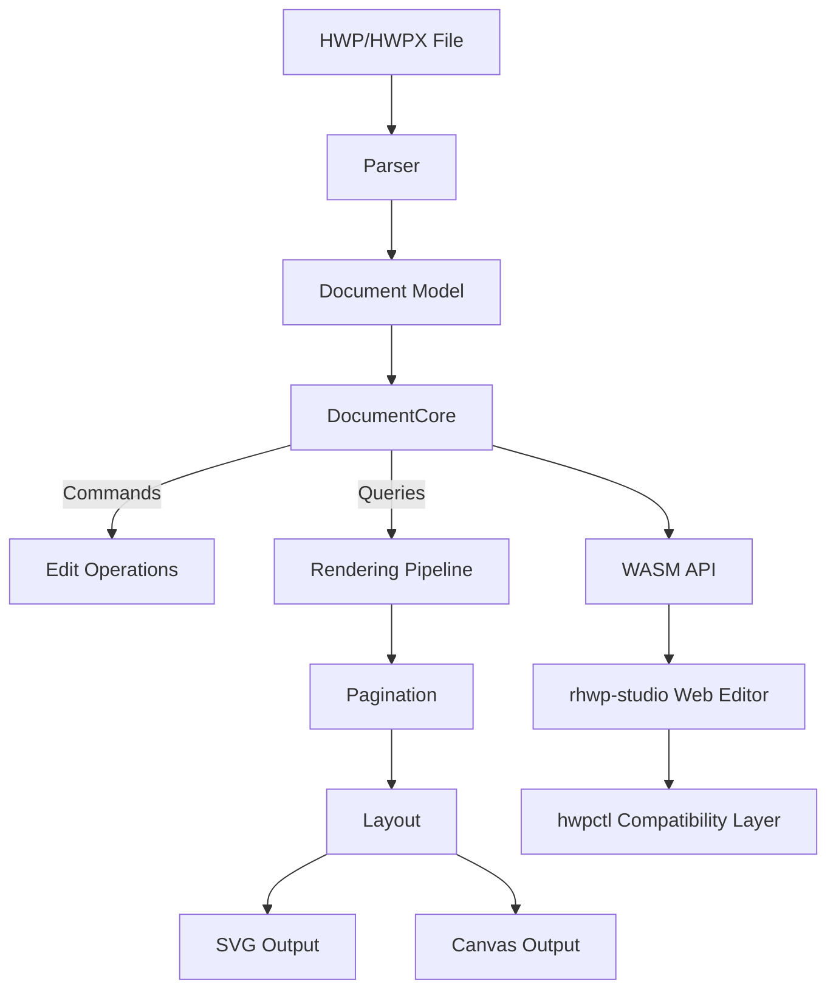

<p align="center">
  
</p>

<h1 align="center">rhwp</h1>

<p align="center">
  <strong>All HWP, Open for Everyone</strong><br/>
  <em>Open-source HWP document viewer & editor — Rust + WebAssembly</em>
</p>

<p align="center">
  <a href="https://github.com/edwardkim/rhwp/actions/workflows/ci.yml"></a>
  <a href="https://edwardkim.github.io/rhwp/"></a>
  <a href="https://www.npmjs.com/package/@rhwp/core"></a>
  <a href="https://marketplace.visualstudio.com/items?itemName=edwardkim.rhwp-vscode"></a>
  <a href="https://opensource.org/licenses/MIT"></a>
  <a href="https://www.rust-lang.org/"></a>
  <a href="https://webassembly.org/"></a>
</p>

<p align="center">
  <a href="README.md">한국어</a> | <strong>English</strong>
</p>

---

Open **HWP files anywhere**. Free, no installation required.

**HWP** is the dominant document format in South Korea — used by government agencies, schools, courts, and most organizations. Until now, there has been no viable open-source solution to read or edit these files.

rhwp changes that. Built with Rust and compiled to WebAssembly, it renders HWP documents directly in the browser with accuracy that matches (and sometimes exceeds) the proprietary viewer.

> **[Live Demo](https://edwardkim.github.io/rhwp/)** | **[VS Code Extension](https://marketplace.visualstudio.com/items?itemName=edwardkim.rhwp-vscode)** | **[Open VSX](https://open-vsx.org/extension/edwardkim/rhwp-vscode)**

<p align="center">
  
</p>

## npm Packages — Use in Your Web Project

### Embed a Full Editor (3 lines)

Embed the complete HWP editor in your web page — menus, toolbars, formatting, table editing, everything included.

```bash
npm install @rhwp/editor
```

```html
<div id="editor" style="width:100%; height:100vh;"></div>
<script type="module">
  import { createEditor } from '@rhwp/editor';
  const editor = await createEditor('#editor');
</script>
```

### HWP Viewer/Parser (Direct API)

Use the WASM-based parser/renderer directly to render HWP files as SVG.

```bash
npm install @rhwp/core
```

```javascript
import init, { HwpDocument } from '@rhwp/core';

globalThis.measureTextWidth = (font, text) => {
  const ctx = document.createElement('canvas').getContext('2d');
  ctx.font = font;
  return ctx.measureText(text).width;
};

await init({ module_or_path: '/rhwp_bg.wasm' });

const resp = await fetch('document.hwp');
const doc = new HwpDocument(new Uint8Array(await resp.arrayBuffer()));
document.getElementById('viewer').innerHTML = doc.renderPageSvg(0);
```

| Package | Purpose | Install |
|---------|---------|---------|
| [@rhwp/editor](https://www.npmjs.com/package/@rhwp/editor) | Full editor UI (iframe embed) | `npm i @rhwp/editor` |
| [@rhwp/core](https://www.npmjs.com/package/@rhwp/core) | WASM parser/renderer (API) | `npm i @rhwp/core` |

## Features

### Parsing
- HWP 5.0 binary format (OLE2 Compound File)
- HWPX (Open XML-based format)
- Sections, paragraphs, tables, textboxes, images, equations, charts
- Header/footer, master pages, footnotes/endnotes

### Rendering
- **Paragraph layout**: line spacing, indentation, alignment, tab stops
- **Tables**: cell merging, border styles (solid/double/triple/dotted), cell formula calculation
- **Multi-column layout** (2-column, 3-column, etc.)
- **Paragraph numbering/bullets**
- **Vertical text**
- **Header/footer** (odd/even page separation)
- **Master pages** (Both/Odd/Even, is_extension/overlap)
- **Object placement**: TopAndBottom, treat-as-char (TAC), in-front-of/behind text
- **Image crop & border rendering**

### Equation
- Fractions (OVER), square roots (SQRT/ROOT), subscript/superscript
- Matrices: MATRIX, PMATRIX, BMATRIX, DMATRIX
- Cases, alignment (EQALIGN), stacking (PILE/LPILE/RPILE)
- Large operators: INT, DINT, TINT, OINT, SUM, PROD
- 15 text decorations, full Greek alphabet, 100+ math symbols

### Pagination
- Multi-column document column/page splitting
- Table row-level page splitting (PartialTable)
- shape_reserved handling for TopAndBottom objects
- vpos-based paragraph position correction

### Output
- SVG export (CLI)
- Canvas rendering (WASM/Web)
- Debug overlay (paragraph/table boundaries + indices + y-coordinates)

### Web Editor
- Text editing (insert, delete, undo/redo)
- Character/paragraph formatting dialogs
- Table creation, row/column insert/delete, cell formula
- hwpctl-compatible API layer (Hancom WebGian compatible)

### hwpctl Compatibility
- 30 Actions: TableCreate, InsertText, CharShape, ParagraphShape, etc.
- ParameterSet/ParameterArray API
- Field API: GetFieldList, PutFieldText, GetFieldText
- Template data binding support

## Quick Start (Build from Source)

### Requirements
- Rust 1.75+
- Docker (for WASM build)
- Node.js 18+ (for web editor)

### Native Build

```bash
cargo build                    # Development build
cargo build --release          # Release build
cargo test                     # Run tests (783+ tests)
```

### WASM Build

```bash
cp .env.docker.example .env.docker   # First time: copy env template
docker compose --env-file .env.docker run --rm wasm
```

Build output goes to `pkg/`.

### Web Editor

```bash
cd rhwp-studio
npm install
npx vite --port 7700
```

Open `http://localhost:7700` in your browser.

## CLI Usage

### SVG Export

```bash
rhwp export-svg sample.hwp                         # Export to output/
rhwp export-svg sample.hwp -o my_dir/              # Custom output directory
rhwp export-svg sample.hwp -p 0                    # Specific page (0-indexed)
rhwp export-svg sample.hwp --debug-overlay         # Debug overlay
```

### Document Inspection

```bash
rhwp dump sample.hwp                  # Full IR dump
rhwp dump sample.hwp -s 2 -p 45      # Section 2, paragraph 45 only
rhwp dump-pages sample.hwp -p 15     # Page 16 layout items
rhwp info sample.hwp                  # File info
```

### Debugging Workflow

1. `export-svg --debug-overlay` → Identify paragraphs/tables by `s{section}:pi={index} y={coord}`
2. `dump-pages -p N` → Check paragraph layout list and heights
3. `dump -s N -p M` → Inspect ParaShape, LINE_SEG, table properties

No code modification needed for the entire debugging process.

## Roadmap

```
0.5 ──── 1.0 ──── 2.0 ──── 3.0
Foundation  Typeset   Collab    Complete
```

| Phase | Direction | Strategy |
|-------|-----------|----------|
| **0.5 → 1.0** | Systematize typesetting engine on read/write foundation | Build core architecture solo, make it solid |
| **1.0 → 2.0** | Open community participation on AI typesetting pipeline | Lower the barrier to contribution |
| **2.0 → 3.0** | Community-driven features toward public asset | Reach parity with Hancom |

## Project Structure

```
src/
├── parser/                    # HWP/HWPX file parser
├── model/                     # HWP document model
├── document_core/             # Document core (CQRS: commands + queries)
├── renderer/                  # Rendering engine (layout, pagination, SVG/Canvas)
├── serializer/                # HWP file serializer (save)
└── wasm_api.rs                # WASM bindings

rhwp-studio/                   # Web editor (TypeScript + Vite)
mydocs/                        # Development documentation (Korean + English)
mydocs/eng/                    # English translations (724 files)
```

## Built with AI Pair Programming

This project is developed using **[Claude Code](https://claude.ai/code)** (Anthropic's AI coding CLI) as a pair programming partner. The entire development process is transparently documented — not just the code, but the *thinking process* behind it.

### How It Works

A human **task director** and an AI **pair programmer** collaborate through a structured workflow:

```
Task Director (Human)              AI Pair Programmer (Claude Code)
─────────────────────              ────────────────────────────────
Sets direction & priorities   →    Analyzes, plans, implements
Reviews & approves plans      ←    Writes implementation plans
Provides domain feedback      →    Debugs, tests, iterates
Makes architectural decisions →    Executes with precision
Judges quality & correctness  ←    Generates code, docs, tests
```

### The Process

Every task follows a disciplined cycle:

1. **Task registration** — GitHub Issue with clear scope
2. **Implementation plan** — AI writes, human reviews and approves
3. **Step-by-step execution** — Build → Test → Report at each stage
4. **Code review feedback** — Human provides corrections, AI adapts
5. **Completion report** — Results documented for future reference

### What's in `mydocs/`

The `mydocs/` directory (724 files, English translations in `mydocs/eng/`) contains the complete development record:

| Directory | Contents | What You'll Learn |
|-----------|----------|-------------------|
| `orders/` | Daily task logs | How to structure daily AI collaboration |
| `plans/` | Task plans & implementation specs | How to break complex problems for AI |
| `working/` | Step-by-step completion reports | How AI executes and reports progress |
| `feedback/` | Code review feedback | How to guide AI with corrections |
| `tech/` | Technical research docs | How AI analyzes and reverse-engineers |
| `manual/` | Guides (incl. [AI Pair Programming Guide](mydocs/eng/manual/ai_pair_programming_guide.md)) | Best practices distilled |
| `troubleshootings/` | Debugging records | How AI diagnoses and fixes bugs |

### Why This Matters

Most AI coding demos show simple tasks. This project demonstrates AI pair programming **at production scale**:

- **100K+ lines of Rust** — parser, renderer, pagination, editor
- **783+ tests** with zero clippy warnings
- **Reverse engineering** a proprietary binary format
- **Sub-pixel layout accuracy** matching commercial software
- **Full CI/CD pipeline** — from commit to npm publish to GitHub Pages

The `mydocs/` directory is not documentation about the code — it's documentation about **how to build software with AI**. It's an open-source methodology.

## Architecture



## HWPUNIT

- 1 inch = 7,200 HWPUNIT
- 1 inch = 25.4 mm

## Contributing

See [CONTRIBUTING.md](CONTRIBUTING.md) for guidelines.

Questions and ideas are welcome on [Discussions](https://github.com/edwardkim/rhwp/discussions).

## Notice

This product was developed with reference to the HWP (.hwp) file format specification published by Hancom (한글과컴퓨터).

## License

[MIT License](LICENSE) — Copyright (c) 2025-2026 Edward Kim
